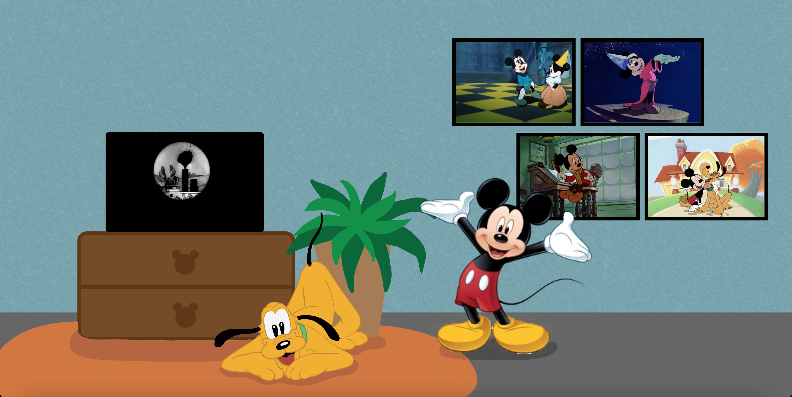

# Procesverslag
Markdown is een simpele manier om HTML te schrijven.  
Markdown cheat cheet: [Hulp bij het schrijven van Markdown](https://github.com/adam-p/markdown-here/wiki/Markdown-Cheatsheet).

Nb. De standaardstructuur en de spartaanse opmaak van de README.md zijn helemaal prima. Het gaat om de inhoud van je procesverslag. Besteedt de tijd voor pracht en praal aan je website.

Nb. Door *open* toe te voegen aan een *details* element kun je deze standaard open zetten. Fijn om dat steeds voor de relevante stuk(ken) te doen.

## Jij

### Ontwerper:
Amber Bellaart

#### Je startniveau:
Mijn startniveau is: blauw

# Je plan

  
De eerste versie/schets van je ontwerp & je persoonlijke uitdaging

  ### De eerste versie/schets:
  

  ### Je ambitie: 
  Aan deze technieken/punten wil ik werken:
  - Punt 1: ik wil sowiezo leren hoe ik überhaupt werkende en overzichtelijke code maak. Ik heb namelijk nog nooit zelf code hoeven schrijven, dus dit is allemaal nieuw. Ik zou dan ook erg blij zijn als alles allemaal werkend en duidelijk is uiteindelijk.
  - Punt 2: ik wil leren hoe ik met diverse elementen, bijv. diverse afbeeldingen en headers, een eindproduct kan maken dat goed in elkaar zit. Nu heb ik bij de twee oefenlesjes nog vooral geoefende met 'weinig' elementen, maar bij deze opdracht zullen er meer dingen samenvallen en zal dat dus meer van mij vragen.
  - Punt 3: ik wil leren hoe ik motivatie uit de overwinningen kan halen bij het coderen, zodat ik die kan gebruiken om met de tegenslagen om te gaan. Ik heb immers nu al in die 2 lesjes gemerkt dat er meer tegenslagen zullen zijn als beginner dan overwinningen (spaties teveel, komma's verkeerd, puntkomma vergeten, etc.). Dit vraagt best wel wat van je motivatie en doorzettingsvermogen. Ik ben wel een doorzetter, maar vind het wel lastig soms om met tegenslagen om te gaan. Dus dit vak helpt me hopelijk ook een beetje op persoonlijk niveau :). 
 

## Voortgang/Feedback 1 (week 1: di en wo)

  
Mijn bevindingen + wijzigingen

  ### Bevinding 1:
  De eerste bevinding die ik eigenlijk al vrij snel had, was dat mijn initiele gekozen onderwerp Mario door heel veel anderen ook was gekozen. Ik vond het niet zo leuk om voor een onderwerp te gaan dat al zovaak gekozen was en merkte dat mijn ideeën bij Mario veel leken op die van anderen. Ik ben toen dan ook geswitcht van onderwerp en heb gekozen voor Mickey Mouse. 

  #### Oplossing:
 Hierbij ben ik gaan schetsen om te kijken waar ik mee kon komen. Uiteindelijk heb ik gekozen voor het idee dat Mickey je door zijn huis als het ware meeneemt dat vol met herinneringen hangt. Dit vind ik een mooie manier, aangezien Mickey al lang meegaat en hij ook een programma had wat 'Mickey Mouse Clubhosue' heette. Hierbij was je ook als het ware in zijn huis waarbij er veel elementen zijn in het interieur die aan Mickey doen denken. Dat idee wilde ik ook creeren maar dan met zijn geschiedenis. Het concept diende ik nog wel verder uit te werken (welke jaartallen, eastereggs, vormgeving van het huis, etc.).

  

  
  ### Bevinding 2:
  In de les van woensdag hebben we feedback gehad op ons concept (zie de eerste versie/schets afbeelding). Ik heb daarbij feedback gehad van Sophie Bierens en de docent. Sophie gaf aan de Mickey's minder random te positioneren, dat de tv met een video een goed idee was, het leuk is om wat accesoires die passen bij Mickey toe te voegen, de radio interactief te maken en een ander karakter zoals Pluto toe te voegen. Sanne gaf aan dat het leuk is om misschien wat achter de schilderijtjes vandaan te laten komen en dat ik goed moet nadenken over de positionering van de diverse Mickeys. Waarom verdient een Mickey een plek aan de muur en de ander in de kast bijv. 
  
  #### Oplossing: 
  Ik neem deze feedback mee bij het verder concretiseren van mijn interface. Zo wil ik pluto gaan verwerken in mijn achtergrond, van de radio een easteregg maken, ga ik de losse kleine Mickeys weglaten, de tv toevoegen, wat accesoires in de achtergrond verwerken en goed nadenken over de Mickeys die ik ga laten zien in mijn tijdlijn + positionering hiervan. 

  ### Bevinding 3:
  Ik kwam erachter dat het heel veel werk zou zijn om mijn gehele achtergrond in HTML/CSS te maken. Ik wilde immers Mickey wel een leuk en gevuld huis geven, dus zou dan heel veel elementen moeten maken. Ik wilde hiervoor dus een oplossing vinden. 
  
  #### Oplossing:
  Ik heb aan Sanne gevraagd of ik de achtergrond zou mogen illustreren in Adobe Illustrator en dan daarop HTML/CSS elementen mogen maken. Dit mocht gelukkig, zolang er maar genoeg elementen in code erin zouden komen. Wel adviseerde hij me om meer aandacht in de code te stoppen dan in de achtergrond. Ik heb daarom ervoor gekozen om de achtergrond eerst even kort te schetsen en daarna aan de slag te gaan met coderen. De achtergrond word ik immers niet echt op beoordeeld, maar maakt het meer af. Daarom ben ik met een schets aan de slag gegaan, zodat ik wel de positie van de elementen goed kon bepalen. Ik ben na de schetsen van hieronder dus eerst vooral met coderen aan de slag gegaan. 
  
 
 
  
  
  ### Bevinding 4:
  Ik ben dit vak begonnen met bijna geen kennis van HTML/CSS/JS. Ik heb enkel de twee hulplesjes gevold, maar moest het hiermee doen. Ik kom immers van Creative Business waar ik dit nooit heb gehad. In het begin wilde ik dus de structuur maken waarin ik mijn elementen kon gaan zetten, maar dit lukte me niet. Ik wilde immers twee afbeeldingen naast elkaar zetten waar ik dan nog losse elementen later aan toe kon voegen. Ik had geen idee hoe ik dit voor elkaar moest krijgen, dus heb hiervoor om hulp gevraagd. 

  ##### Oplossing:
  Met hulp van Rowin Schmidt heb ik een structuur in elkaar kunnen zetten van twee 'pagina's' naast elkaar waar ik dan later zelf elementen in kan toevoegen. Dit is gedaan door middel van een ol met 2 li's. Hierin heb ik dan ook weer li's en andere elementen zoals articles. Ik wilde immers ook van de schilderijen en dergelijke een ol maken, aangezien dat hierbij passend is. Hij heeft daarbij de structuur duidelijk uitgelegd, zodat ik hier zelf ook mee verder kan. 
  
  
  ### Bevinding 5:
  Een andere grote uitdaging in deze dagen mbt coderen was het maken van een kast en lijstjes op de twee pagina's. Nadat er twee pagina's gemaakt waren, besloot ik hier eerst mee aan de slag te gaan, aangezien deze de basis vormden voor de tijdlijn. Ik heb eerst de kast in de les gemaakt. Hierbij heb ik soms een korte vraag gesteld, zodat ik hiermee verder kon. Wel heb ik hier veel geprobeerd zelfstandig te doen. Het maken hiervan kon immers grotendeels met de kennis die ik opgedaan had in de twee hulplesjes. Daar had ik immers geleerd een grid te maken en dergelijke. Ik kreeg het alleen niet voor elkaar om 'plankjes' te maken in de kast. Dit heb ik dan ook uiteindelijk gevraagd. Het maken van de galerij was wel erg lastig, want mijn afbeeldingen wilde maar niet goed in het grid komen te staan (zie hieronder). 
 
  
  
  #### Oplossing:
  Uiteindelijk heb ik van de docent hulp gehad bij het maken van 'plankjes' in de kast dmv een background gradient. Het probleem met de galerij heb ik zelf uiteindelijk opgelost. Anderen zagen het in eerste instantie ook niet, dus ben ik zelf door mn code gegaan en heb ik dingen aan en uit gezet. Uiteindelijk kwam ik er na een lange tijd achter dat ik 'last of type' moest toevoegen op een bepaald punt ipv 'first of type'.
  
  

## Voortgang/Feedback 2 (week 1: do en vr)

  
Mijn bevindingen + wijzigingen

  
  ### Bevinding 1:
  Een van de dingen waar ik tegenaan liep was hoe ik tekst tevoorschijn kon laten komen als ik op een lijstje/afbeelding zou klikken. Dit zou dan voor elke afbeelding andere tekst moeten zijn. Ik had echt geen idee waar ik zou moeten beginnen om dit voor elkaar te krijgen. Sam Landsdaal vertelde mij dat dit mogelijk was met JavaScript. Hij heeft me de code uitgelegd en daarna laten toepassen voor mijn werk. 

  #### Oplossing:
  Sam heeft me door de diverse stappen meegenomen voor één afbeelding, zodat ik deze later zelf uit zou kunnen voeren voor alle andere afbeeldingen. Hij legde het heel helder uit, waardoor ik ook de structuur wel aardig snap. Toen ik het zelf ging toepassen (op een ander scherm) merkte ik echter dat het niet werkte. Sam heeft toen nogmaals meegekeken en kwam erachter dat ik voor een andere li (dus ander scherm in de hoofd-ol) een extra aanpassing diende te doen. Ik vond het fijn dat dit in de les ontdekt is, want hierdoor kon ik daarna in het weekend zelf alle code voor alle afbeeldingen schrijven. Hieronder is te zien hoe die teksten er in het begin uitzagen. 
  
  

  
  ### Bevinding 2:
  Toen ik eenmaal voor elkaar had dat er nieuwe tekstvakken verschenen als er op de afbeeldingen geklikt werden, besloot ik om de tekstvakken wat op te vrolijken en passender te maken bij Mickey. Dit wilde ik doen door Mickey-oortjes toe te voegen. Ik had hierbij alleen geen idee hoe ik die het beste toe kon voegen weer, aangezien ik bij de tekstvakken ook met JavaScript aan de slag was gegaan.
  
  #### Oplossing:
  Ik heb uiteindelijk wat advies aan Sam nog gevraagd, waardoor ik de oortjes kon gaan maken. Door middel van een tip van de docent kon ik deze makkelijk achter het tekstvak plaatsen. Het vormgeven van de oortjes en het tekstvak en positioneren hiervan heb ik wel geheel zelf gedaan, aangezien ik deze kennis gewoon in huis had. Hieronder is het begin en het eind te zien van de vormgeving. 
  
  
  

  
  ### Bevinding 3:
  Ik vond dat ik wel een los voorwerp met HTML/CSS moest vormgeven, aangezien het vak over coderen gaat. Daarom heb ik besloten om de radio geheel te coderen. Voor de radio wilde ik immers ook iets doen met animeren of een easteregg, dus was dit wel zo verstandig. Ik ben daarom de radio gaan coderen. Daarbij heb ik ook een gradient toegepast en knoppen toegevoegd. Deze knoppen kan ik immers dan weer later gebruiken bij de animatie. Ook heb ik met de opgedane kennis over JavaScript muzieknoten in een hover toegevoegd. Dus als je nu over de radio gaat, krijg je die muzieknootjes te zien die ook nog kunnen bewegen. Wel krijg je die enkel bewegend als je over de muzieknoten zelf gaat, dus dat wil ik eigenlijk nog oplossen. Ook wil ik nog iets van muziek toevoegen. 
  
  

  #### Oplossing:
  Ik heb muziek proberen toe te voegen, maar dat ging nog niet helemaal goed. Ik wilde immers dat de muziek zich enkel afspeelde als je op de radio klikte of erover hoverde, niet standaard op de pagina. Dat vond ik immers afbreuk doen aan het easteregg effect. Dat wil ik dus nog even vragen aan anderen, aangezien ik vermoed dat dat weer met JavaScript gedaan dient te worden. Dus dit moet nog even opgelost worden. 

  
  ### Bevinding 4:
  Ik merkte ook wel dat ik het vervelend vond dat mijn illustratie nog niet af was, want daardoor kon ik nog minder het geheel voor me zien. Zo zag Pluto er nog vrij zielig uit, waren het tv kastje en de plank niet helemaal recht en waren de planten nog niet echt mooi in beeld gevracht. Tevens belemmerde het soms met de plaatsing van elementen in de code. Ik besloot dus dat hier wat aan gedaan diende te worden. 

  #### Oplossing:
  Uiteindelijk heb ik mijn illustratie afgemaakt door naar mijn code te kijken. Ik heb de schaduwen geplaatst op de plekken waar Mickey staat, de kast staat en de plank goed onder de radio geplaatst. Zo hoefde ik niet meer in de codering positionering aan te passen, want dit had ik als het ware gedaan in de illustratie. Dit was de makkelijkere manier, aangezien dit minder handelingen nodig had. Bij de radio zou ik dan bijvoorbeeld ook de knoppen en dergelijke moeten verplaatsen. Ik heb in de illustratie wat Mickey details toegevoegd, zoals een boekensteun en Mickey handvaten op de tv kast. Wel heb ik geprobeerd niet teveel detail toe te voegen, aangezien ik wel wilde dat de aandacht naar de juiste elementen zou gaan.
  
   
  
  
  
  ### Bevinding 5:
  In de tekstvakken van de afbeeldingen wilde ik relevante tekst zetten die passend was bij die specifieke cartoon. Ik had een aantal sites (zie bronnenlijst) gevonden die de basis vormden voor mijn keuzes in de cartoons. Hier heb ik dan ook grotendeels de informatie vanaf gehaald over de diverse cartoons. Ik merkte zelf wel bij het zoeken naar informatie dat er bij de ene cartoon meer te vertellen was dan bij de ander. 

  #### Oplossing:
  Zo moest ik bij hele bekende cartoons de tekst echt inkorten, omdat het anders niet meer paste in de tekstvakken. Bij anderen zoals 'Mickey Mouse Works' moest ik juist weer wat tekst erbij schrijven. Zo heb ik zelf nog wat analyses gedaan tussen de diverse tijdperken, zodat ik ook soms nog wat uiterlijke verschillen kon benoemen die niet in de bronnen benoemd waren. Uiteindelijk heeft dit teksten opgeleverd die ongeveer even lang zijn. 
  
  

## Voortgang/Feedback 3 (week 2: ma en di)

  
Mijn bevindingen + wijzigingen

  
  ### Bevinding 1:
  Iets anders wat ik dus niet voor elkaar kreeg in de code was het afspelen van muziek als een knop ingedrukt wordt/ergens overheen gehovert wordt. Ik had immers knoppen aangemaakt die ik daarvoor kon gebruiken, maar dit wilde nog niet helemaal lukken. Ik heb daarbij online de code opgezocht die ik hiervoor zou moeten gebruiken, maar kwam niet helemaal eruit hoe die JavaScript structuur precies in elkaar zat. Ik heb daarom om hulp gevraagd, zodat ik dit wel zou snappen. 

  #### oplossing:
  Timo Smit heeft meegekeken en me de structuur uitgelegd. Hij heeft daarbij stap voor stap verteld wat ik diende te doen om het werkend te maken. Daarbij heeft hij ook geholpen om ervoor te zorgen dat de knop zowel aan als uit kon en dat de muziek dat dan ook zou doen. Ik heb daarna de verschillende states van de knop aangepast. Ik merkte echter dat de knop niet aan bleef staan als je erop klikte, want dan ging hij weer terug naar de 'normale' versie. Ook dit vond ik niet helemaal de juiste manier. Hier konden anderen me niet mee helpen, dus ben ik naar de docent gegaan die mij hierbij geholpen heeft. Hiervoor is er weer een nieuwe state aangemaakt die laat zien dat de knop en de muziek nog aan staan. 

  

  ### Bevinding 2:
  > link maken dat je tussen pagina's kunt schakelen.
  Omschrijving van wat er nog niet orde was (tekst en afbeeding(en)).

  #### oplossing:
  Beschrijving hoe je het hebt hebt opgelost of als het niet gelukt is hoe je het zou oplossen (tekst en afbeeding(en)).

  ### Bevinding 3:
  Maandags liep ik tegen problemen aan met mijn code en GitHub. Zo merkte ik dat mijn afbeeldingen in GitHub niet wilden inladen. Ik zah hierbij het probleem niet echt, aangezien de bestandsnamen precies overeenkwamen. Uiteindelijk hoorde ik van een klasgenoot dat het lag aan het feit dat in mijn bestandsnamen spaties zaten. Ik had niet opgeslagen dat dit niet mocht, dus moest daardoor alle namen veranderen. Wat betreft mijn code bleek dat ik camelCase nog niet goed had toegepast
  
  #### Oplossing:
  Om het GitHub probleem op te lossen heb ik dus alle bestandsnamen van de afbeeldingen aangepast, zodat deze geen spaties meer bevatten. Ook kreeg ik mbt Github de tip van Rowin Schmidt dat het verstandig is om je cache regelmatig te legen als het niet wil werken. Dit kan soms tegenwerken wanneer je iets werkend wil krijgen, want hierdoor kan je een vertekend beeld krijgen van hoe alles werkt. Later heb ik deze tip ook nog van de docent gekregen. Ook de camelCase heb ik uiteindelijk nog overal in mijn werk toegevoegd, zodat dit consistent gebeurd is.
  
  
  
  ### Bevinding 4:
  Maandag 25 april heb ik nog feedback van Timo gehad aan de hand van de checklist die hieronder te zien is. De belangrijkste verbeterpunten daarbij waren: het meer responsive maken van de website (bijv schaduwen van Mickey en kast apart invoegen), de diverse states van knoppen en links maken, headings van secties in H2's veranderen (dus maar 1 H1 op de website) en de HTML/CSS/JS in orde maken met commentaren, structuur, naamgevingen, custom properties en dergelijke zaken.
  
  
  
  
  #### Oplossing:
  Het eerste verbeterpunt heb ik proberen op te lossen door de schaduw van Mickey en de kast apart in te voegen. Deze heb ik toen op de plek gezet waar de schaduw eerst in de illustratie stond. De schaduw verplaatste zich helaas heel gek wanneer de schermgrootte aangepast werd, dus het loste mijn 'responsive' probleem niet echt op. Daarom heb ik besloten om de schaduw in de illustratie te laten, aangezien de schaduw hierbij nog het meeste 'klopte'. Voor een volgende keer zou ik dan veel meer elementen afzonderlijk met CSS moeten maken, wil ik dat alles goed responsive is. Voor nu was dat binnen de tijd en met mijn kennis nog niet heel haalbaar. De diverse states heb ik diezelfde dag nog aangepast, waarbij ik zelfs wat extra's met behulp van Sanne heb toegevoegd aan de radio (de playing after state). De opmerking over de H1's die H2's moesten worden heb ik voorgelegd bij Sanne, waaruit bleek dat het in principe gewoon goed staat met de H1's. Dit heb ik daarom zo gelaten. Het verbeteren van mijn HTML/CSS/JS heb ik dinsdags gedaan, aangezien ik dit als allerlaatste wilde doen.
  
  
  ### Bevinding 5:
  Dinsdag 26 april hebben Sophie en ik nog feedback op elkaars werk gegeven. Ze vind het werk er leuk uit zien. De kleuren passen volgens haar goed bij elkaar, het concept van het huis past bij Mickey vanwege het huiselijke gevoel, de tv is leuk en Pluto erin verwerkt hebben vind ze een leuke touch. Een verbeterpunt was dat de radio button niet meer terug geklikt kan worden en het geluid zich niet afspeelt in Github. Ook gaf ze aan dat ik misschien de schaduw bij de Mickey tekstvlakken weg kan laten, omdat dat minder past bij de rest van de vormgeving. Tot slot gaf ze aan dat ik misschien de schaduw onder Mickey weg zou kunnen halen, aangezien die niet erg responsive is. Dit zijn dingen om volgens haar over na te denken.
  
  #### Oplossing:
  
  
  Oplossing van muziek en knop>javascript audio linken uit html ipv apart.
  harde cache legen en reload zodat alles opnieuw inlaad.
  
  Beschrijving hoe je het hebt hebt opgelost of als het niet gelukt is hoe je het zou oplossen (tekst en afbeeding(en)).

## Reflectie

  
Mijn eindresultaat & persoonlijke ontwikkeling

  ### Je uitkomst - karakteristiek screenshot(s):
  

  ### Dit ging goed/Heb ik geleerd: 
  Korte omschrijving met plaatje(s)

  

  ### Dit was lastig/Is niet gelukt:
  Korte omschrijving met plaatje(s)

  

## Bronnenlijst

Mijn gebruikte bronnen gedurende het vak

Nb. Wees specifiek ('css-tricks' als bron is bijv. niet specifiek genoeg).

1. Klasgenoten, waarbij voornamelijk: Rowin Schmidt, Sam Landsdaal, Timo Smit, ...
2. De docent: Sanne....
3. 
4.
5.
6.
7.
8.
9.
10. 
  

